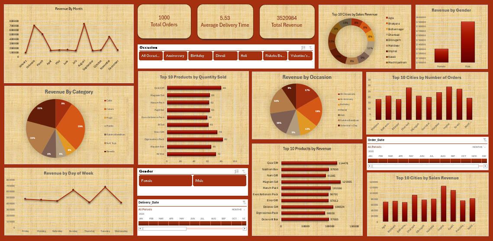
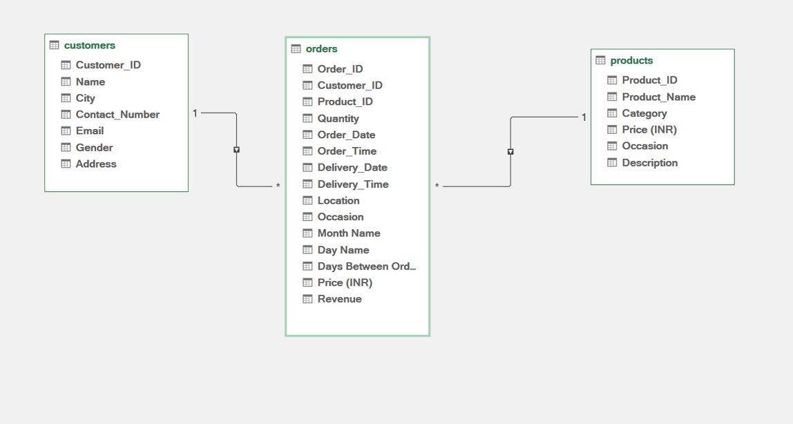
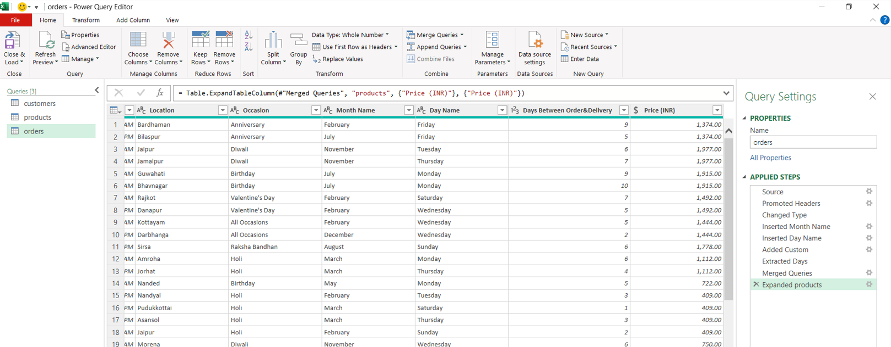

# 📊 Excel Sales Dashboard Project

## 🔍 Project Description  
This project focuses on analyzing and visualizing sales data using Microsoft Excel, Power Query, and Power Pivot. It helps understand key sales insights such as total revenue, top-selling products, customer trends, and revenue by category and city .

## 🧰 Tools Used  
- Microsoft Excel  
- Power Query  
- Power Pivot  
- DAX (for revenue calculation)  
- Pivot Tables & Charts

## 📁 Dataset Overview  
The dataset consists of three related tables:
- **Customers**
- **Products**
- **Orders**

Data was cleaned and merged using Power Query, relationships were created in Power Pivot, and analysis was done using Pivot Tables and visualizations.

## 📸 Dashboard Preview 

---  
- 💼 [LinkedIn](https:www.linkedin.com/in/ahmed-abdelmoaty-2b6860357)  
- 📧 [Gmail](aabdelmoaty133@gmail.com)
